[](https://github.com/mattrglobal)

# Credential Provider - Sample Use-Case

## 📝 Description

This sample-app is designed to showcase implementation patterns for OpenID4VCI capabilities of the MATTR VII Platform following a common real-world use-case.

## 📍 What can you expect once you start running this app?

A URL of will be generated on the console.

You can copy paste it into a browser and see a QR code on screen. This QR code is for credential offering via OpenID4VCI which you can scan to experience the flow.

## 🚗 Use-case

This sample app will act as the API behind the **Kākāpō Transport Agency**. It will generate a link to a QR code that issues your new Drivers' License to your wallet via OpenID4VCI provided by the MATTR VII platform.

Behind the scenes, the Kākāpō Transport Agency uses [Auth0](https://auth0.com/) as an identity provider.

Inevitably, the Kākāpō Transport Agency also has its own databases to store sensitive & confidential information, such as the _license number_ of a driver. When issuing new drivers licenses, it is not enoguh to only use information available on the IDP (Auth0). This is why the Kākāpō Transport Agency also configured a [**claim source**](https://learn.mattr.global/tutorials/offer/openid-credential-provisioning/configure-a-claims-source) on MATTR VII. This helps MATTR VII issue credentials using detailed driver/license information by connecting to a Kākāpō Transport Agency data source via an API endpoint they have built themselves. (In our case: `GET localhost:3000/core/user?email=ANY_EMAIL`.)

## 🧠 Technical Journey
This diagram assumes that you've already finished setting up the sample-app and is showcasing the flow from the moment you scanned the QR code

```mermaid
sequenceDiagram
    actor Driver
    actor Wallet as 📱 Wallet
    participant KTA as 🚗 Kākāpō Transport Agency API
    participant IDP as 🔐 IDP (Auth0)
    participant IH as 🎨 Interaction Hook UI
    participant CS as 📚 Claim Source DB
    participant MATTR as ⚛️ MATTR VII

    KTA ->> Driver: Notifies the driver that they passed their driving test
    KTA ->> MATTR: Starts issuing drivers' license credential
    MATTR ->> Wallet: Creates Credential Offer
    note over Wallet, MATTR: QR code created
    Driver ->> Wallet: Proceeds to claim credential
    note over Wallet: Redirects the driver to the login page of the IDP from Wallet WebView
    Wallet ->> IDP: Driver logs into their Auth0 account
    IDP -->> Wallet: Driver authenticated
    Wallet ->> IH: Redirecting driver to the Interaction Hook UI (For 2FA/MFA such as biometric checks, etc)
    note over Wallet, IH: UI - GET demo.ngrok.app/core/2fa?session_token=JWT_TOKEN
    IH -->> Wallet: Driver verified
    MATTR ->> KTA: Makes request to fetch additional claims using emails provided from the Auth0
    KTA ->> CS: Fetching addtional claims
    note over KTA, CS: GET demo.ngrok.app/core/user?email=EMAIL_ADDRESS
    CS -->> KTA: Fetched additional claims - Status 200
    KTA -->> MATTR: Returning additional claims to MATTR VII for credential generation
    note over MATTR: Mapping claims into credential
    MATTR -->> Wallet: Offering drivers' license credential with claims mapped from claim source
    Driver ->> Wallet: Driver collects the credential
```



## ✅ Our sample-app will help you with

1. Exposing a **claim source** using an ngrok tunnel.
   The API endpoint `GET /core/user` will be exposed an a ngrok tunnel URL, e.g.
   with `something.ngrok.app/core/user`
   running `GET something.ngrok.app/core/user?email=demo@joe.doe`
   will return an object where the `email` is `demo@joe.doe`
2. Setup an Interaction Hook UI (OpenID Configuration) using `something.ngrok.app/core/2fa` which serves as the UI for users verifying themselves with 2FA (fictionally)
3. Configuring a **claim source** on your MATTR VII tenant using `something.ngrok.app/core/user` as the `url`.
4. Creating a **credential configuration** on your MATTR VII tenant of type `DriversLicense`, using the `id` of the claim source from step 2.
5. Creating a **credential offer issuance URI** on your MATTR VII tenant using the `id` of the credential configuration from step 3.
6. Constructing a URL for a **QR code** using the credential offer issuance URI.
   The URL is the response of `POST /core/qrcode` and will be printed in the console.

## ⚡ So that

1. You don't have to create your own claim-source
2. You don't have to configure your own interaction-hook
3. You don't have to generate the credential QR Code for you to sign / collect the credentials
4. You can scan, authorise and claim a sample credential via OpenID4VCI capabilities with minimal efforts

## ☝️ While you are still responsible for

1. Setting up your **local development** environment with Node and NPM/Yarn. Your computer needs to be able to make outbound calls to the internet.

2. Creating an **Auth0 application** and adding 2 users with the email addresses `demo@joe.doe` and `demo@jose.iglesias`, respectively.

3. Getting a valid access token for the **MATTR Platform**. If you do not have a tenent set up, [get started here](https://mattr.global/get-started).

4. [Creating/Updating an authentication provider](https://learn.mattr.global/api-reference/v2.0.0#operation/createAuthenticationProvider) on MATTR VII using the Auth0 application from step2. More details in [here](#🔒-how-to-setup-your-authentication-provider)

5. Getting `NGROK_AUTH_TOKEN` from your Ngrok account ([Create an account if you don't have one](https://ngrok.com/))

# 🚗💨 How to run this app?

```sh
# 1. Clone the samples-apps repo
git clone https://github.com/mattrglobal/sample-apps

# 2. Change to the directory
cd credential-provider

# 3. Install dependencies
yarn install --frozen-lockfile

# 4. Create a `.env` file, populate it with the variables from `.env-template` and fill in the values accordingly.

# 5. Start the server
yarn start
```

## 🌐 How to get the URL for QR code?

When running the app, you should see a log in your terminal, similar to the one below. Copy the `api.qrserver.com` URL and paste it into your browser to get the QR code.

```
[Nest] 22206  - 10/05/2023, 17:12:52     LOG [NestApplication] Nest application successfully started +0ms
[Nest] 22206  - 10/05/2023, 17:12:54     LOG [bootstrap] 💫 App running on https://localhost:3000
[Nest] 22206  - 10/05/2023, 17:12:54     LOG [bootstrap] 🎨 Swagger UI running on https://localhost:3000/api
[Nest] 22206  - 10/05/2023, 17:12:54     LOG [bootstrap] 👉 Your Ngrok URL: https://ac4975aaf2a9.ngrok.app
...
...
[Nest] 22206  - 10/05/2023, 17:12:54     LOG [CoreService] ⚡ QR Code URI retrieved
====👇 Copy and paste the URL below into your browser 👇 ===

https://api.qrserver.com/v1/create-qr-code/?size=200x200&data=PLACEHOLDER_URI

===== Scan the QR code and claim your credential =====
```

## How to claim your `Drivers' License` once you've scanned the QR code?
Steps: 
1. On your MATTR Wallet, click to `PROCEED` once you scanned the QR code
2. On the Auth0 login page, enter the username and password for either `demo@joe.doe` or `demo@jose.iglesias` (the users you created for this demo on your Auth0 application), then click `Continue` on the Auth0 login page from the MATTR Wallet WebView
3. On the **UI for Interaction Hook page**, click on **Verify** -> This is a dummy page prompting you to enter your 6-digit verification code (which you don't have to in this case)
4. Wait for the wallet to authorise you & create the credential before sending it to your wallet
5. Now you are redirected back to the wallet where you'll see the **Kākāpō Drivers License** issued to you via the OID4VCI flow. Click on the **VIEW** button to see the credential
6. On the credential details page, you should see the `email`, `name` and `licenseNumber` are the same ones from our `src/constants/claim-source.ts` file.

   |                                                      Step 1                                                      |                                                      Step 2                                                      |                                                      Step 3                                                      |                                                      Step 4                                                      |                                                      Step 5    | Step 6 |
   | :--------------------------------------------------------------------------------------------------------------: | :--------------------------------------------------------------------------------------------------------------: | :--------------------------------------------------------------------------------------------------------------: | :--------------------------------------------------------------------------------------------------------------: | :--------------------------------------------------------------------------------------------------------------: | :--------------------------------------------------------------------------------------------------------------: |
   |  |  |  |  |  |  |

## 🔒 How to setup your Authentication Provider?
### **❌ If you received the following error when you run the app:**
#### `❗ Please create an Authentication Provider`
It means you haven't yet let MATTR VII know which IdP to use for OID4VCI.

Assuming that you've already:
1. Created/Signed up for an Auth0 account
2. Created a new application (`Regular Web App`) on Auth0
3. Can see the `Client ID`, `Client Secret`, and the `Domain` for your application

Here's what you need to do:

1. Make a request to [create an Authentication Provider](https://learn.mattr.global/api-reference/v2.0.0#operation/createAuthenticationProvider) using [our postman collection](https://github.com/mattrglobal/sample-apps/tree/master/postman), you should get a response, let's call it `AUTH_PROVIDER` 

In the request body, make sure to set scope to `["openid","email","profile"]`, and claimsToSync to `["email"]`.

2. On your Auth0 Application, add the `redirectUrl` from `AUTH_PROVIDER[0].redirectUrl` into the `Allowed Callback URLs` field. This is VERY important, because Auth0 needs to be able to redirect users back to their MATTR Wallet, and this `redirectUrl` serves this purpose.

### **❌ If you received any of the following errors when you run the app:**
1. `Please make sure you include "openid" in the "scopes" array`
2. `Please make sure you include "email" in the "scopes" array`
3. `Please make sure you include "email" in the "claimsToSync" array`

It means your Authentication Provider isn't setup correctly on your tenant.

If you don't include `email` in the `claimsToSync` array, MATTR VII won't be able to sync emails to make queries to get custom claims based on emails from your claim source.

Here's what you need to do:

1. Make a request to [update an Authentication Provider](https://learn.mattr.global/api-reference/v2.0.0#operation/updateAuthenticationProvider) using a payload containing the minimum required values for both the `scopes` and `claimsToSync` array
2. Try run the app again

### ❗IMPORTANT NOTE ❗
Please be careful updating your authentication provider for this sample-app, because you might break your applications that rely on the existing configuration! If you need to update the `url` field of your authentication provider configuration, you will need to **delete** the current configuration and create a new one using the updated url.

## 📚 How does Claim Source work?
From the perspective of MATTR VII, a Claim Source is a REST API endpoint which it can make a `GET` request to and get data to map into the credential during credential issuance via OID4VCI.

You need to tell MATTR VII which API endpoint it needs to hit during credential issuance if you want to populate additional data into the issued credential, which is why you need to [create a claim source](https://learn.mattr.global/api-reference/v2.0.0#tag/Claim-Source) on MATTR VII - as seen in [this code snippet](./src/services/core.service.ts#L150). This endpoint can either be [your own API endpoint](./src/controllers/core.controller.ts#L28) which in this case, takes `email` as a query parameter, or it could be one that your CMS/CRM/ERP exposes by default.

We also recommend protecting the endpoint using `x-api-key`, so that you don't risk exposing sensitive data. In this example, we have implemented a [NestJS Guard](https://docs.nestjs.com/guards) to protect the [controller](./src/controllers/core.controller.ts#L29), you can check out the authorisation logic in [here](./src/guards/claim-source.guard.ts).

## 🪝 How does Interaction Hook (OpenID Configuration) work?
If you require your users to verify themselves after they've logged into your IdP before issuing them the credential, then you need to **enable** interaction hook on MATTR VII like [how we do it](./src/services/core.service.ts#L158).

Generally-speaking, an interaction hook is a web page that does the verification, such as 2FA, MFA or biometric checks before redirecting users back to the mobile wallet if verification is successful.

In our case, the **Kākāpō Transport Agency API** created a [static HTML](./views/2fa.hbs) page as the interaction hook UI, which simply acts as a demo verification page that helps redirecting you back to your wallet without actually implementing 2FA/MFA checks. 

We then [updated your OpenID Configuration](./src/services/core.service.ts#L93) to use the tunnelled ngrok URL so that your wallet would be able to load our interaction hook UI from the internet during credential issuance rather than from your localhost.

## 🤖 Where to get your [Swagger UI](https://swagger.io/tools/swagger-ui/) for this sample app?

While running the app, go to `localhost:3000/api`. You'll see the endpoint being used to create the QR code for the credential offer, as well as the endpoints for the claims source and the interaction hook.

## 🤔 Common issues

<details>
  <summary> Why does my wallet sometimes recognise the QR code but sometimes doesn't? </summary>
  The server metadata responds with a cache control header with `max-age=600`, meaning the mobile wallet will cache the response for 10 mins. Therefore, if the user scans a QR code that contains a new configuration before the existing cache expires, it will result in an error.
</details>

<details>
  <summary> Why is it that I'm able to generate a QR code URI using the latest credential configuration ID but some other times it fails with "Invalid credentials" error? </summary>
  Updates of (and newly created) credential configurations will take up to one minute to propagate to our backend service due to caching. Therefore, if you create an credential offer URI before a new configuration becomes available on our backend, it will result in an error in your wallet.
</details>
