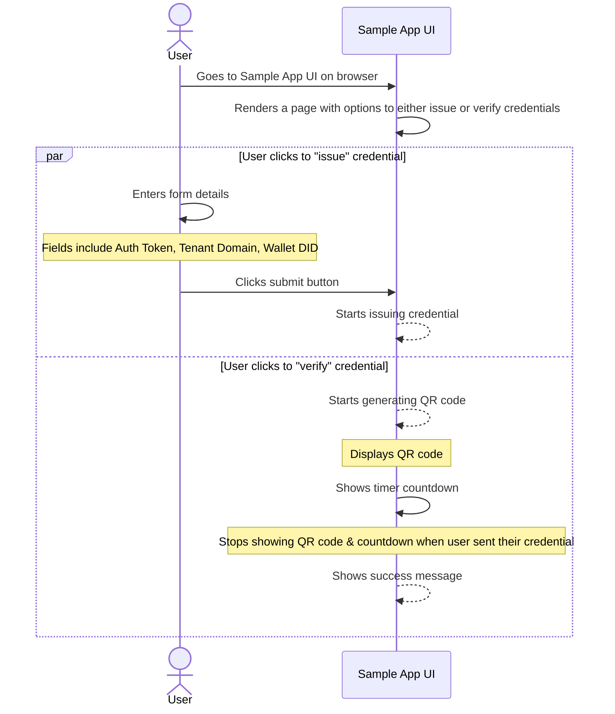

# User Journeys

## Generic flow

```mermaid
sequenceDiagram
    actor USER as User
    participant APP_UI as Sample App UI

    USER ->> APP_UI: Goes to Sample App UI on browser
    APP_UI ->> APP_UI: Renders a page with options to either issue or verify credentials

    par User clicks to "issue" credential
      USER ->> USER: Enters form details
      note over USER: Fields include Auth Token, Tenant Domain, Wallet DID
      USER ->> APP_UI: Clicks submit button
      APP_UI -->> APP_UI: Starts issuing credential
    and User clicks to "verify" credential
      APP_UI -->> APP_UI: Starts generating QR code
      note over APP_UI: Displays QR code
      APP_UI ->> APP_UI: Shows timer countdown
      note over APP_UI: Stops showing QR code & countdown when user sent their credential
      APP_UI -->> APP_UI: Shows success message
    end

```