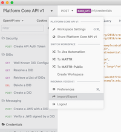
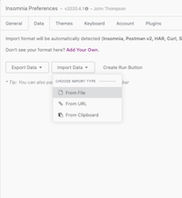
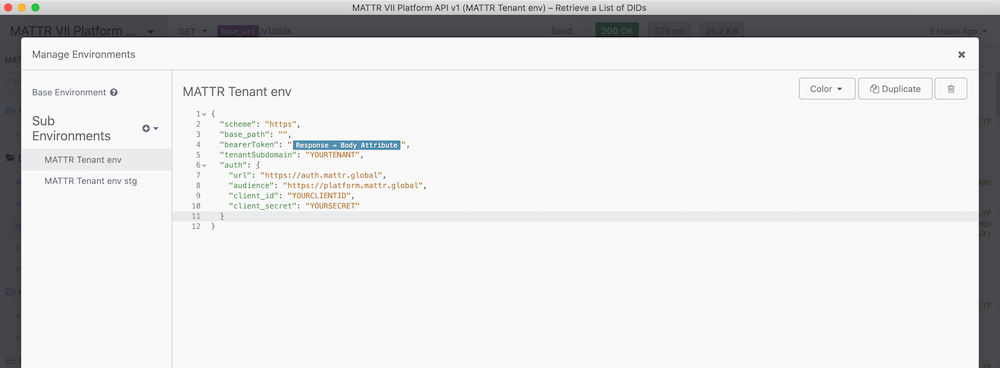
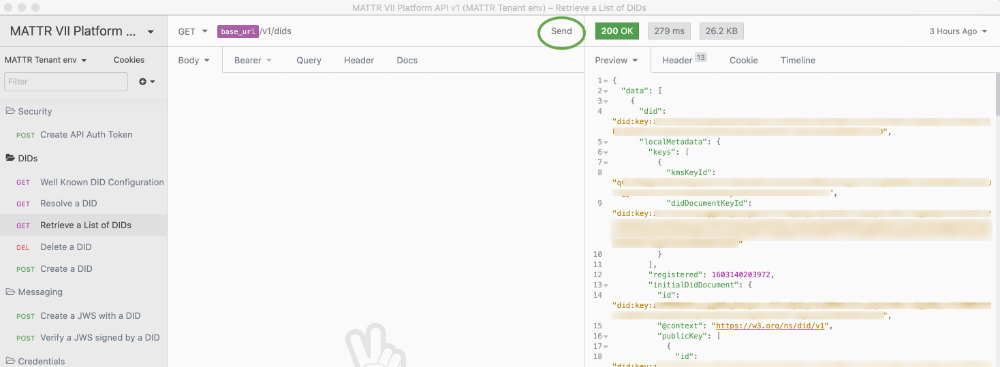

# Insomnia Core
Insomnia Core is a Desktop API client for REST and GraphQL. Make requests, inspect responses.

## Install

Visit the Insomnia Core [downloads page](https://insomnia.rest/download/core/?) to install the desktop client for your system.

## Getting started

- Copy the Insomnia import file 'Insomnia_v0-xx.json' and save locally
- In Insomnia, open 'Import/Export' from the menu

- On 'Import' choose 'From file'  

- Select the saved Insomnia Importer file

## Setup
Inside Insomnia you will now have a Workspace called MATTR-Public.
Inside the workspace there will be an Environment called `Tenant` 
> Insomnia leverages 'Nunjunks Templating', so we use that to make calling our API super easy to use. 

Go to 'Manage Environments'

This will contain a Base Environment.

``` json
{
  "tenant": "https://{{ subdomain }}.platform.mattr.global",
  "baseDomain": "{{subdomain}}.platform.mattr.global",
  "access_token": ""
}
```
The Base Environment pulls together variables from the Sub Environment to help form the requests.
The object in the `access_token` field will do the work to call out to the Auth endpoint on your behalf and grab the required Access Token and make it available to other requests.

If the Variable is Red with a warning sign > click on the variable and in the Request dropdown select

`[External] [MATTR Auth] [Machine to machine] POST Token for Gateway`

Then Done to update the variable.

In the Sub Environment
* Add in your provided Subdomain (e.g. `your-tenant` the protocol and full domain are **not** required ), Client ID and Client Secret.

``` json
{
  "subdomain": "tenant",
  "auth": {
    "base": "https://mattr-prod.au.auth0.com",
    "client_id": "your-client-id",
    "client_secret": "you-client-secret",
    "audience": "https://platform.mattr.global"
  },
  "issuerDid": "did:key:..",
  "verifierDid": "did:key:..",
  "zkpDid": "did:key:....",
  "didUrl": "did:key:..#..",
  "issuer": [
    {
      "id": "58ab2731-16a3-4c4c-a3b2-89fd242d1685",
      "callback": "https:/{{ tenant }}}/oidc/v1/issuers/58ab2731-16a3-4c4c-a3b2-89fd242d1685/federated/callback",
      "credentialName": "Email credential",
      "federatedProviderUrl": "https://fed-provider.com",
      "federatedProviderClientId": "fed-provider-clientid",
      "federatedProviderClientSecret": "fed-provider-secret"
    }
  ],
  "verifier": [
    {
      "id": "dd6e3caa-7b41-4b95-afca-4dc1c41295f7"
    },
    {
      "id": "521e7a9d-2212-4b31-8624-e5ec846a3a54"
    }
  ]
}
```




## Try it out
Go to a protected endpoint e.g.
`DIDs` > `Retrieve a List of DIDs`

Hit `Send` in the top right of the Request pane (middle of the application)

See the response in the `Preview` section of the Response pane on the right.

