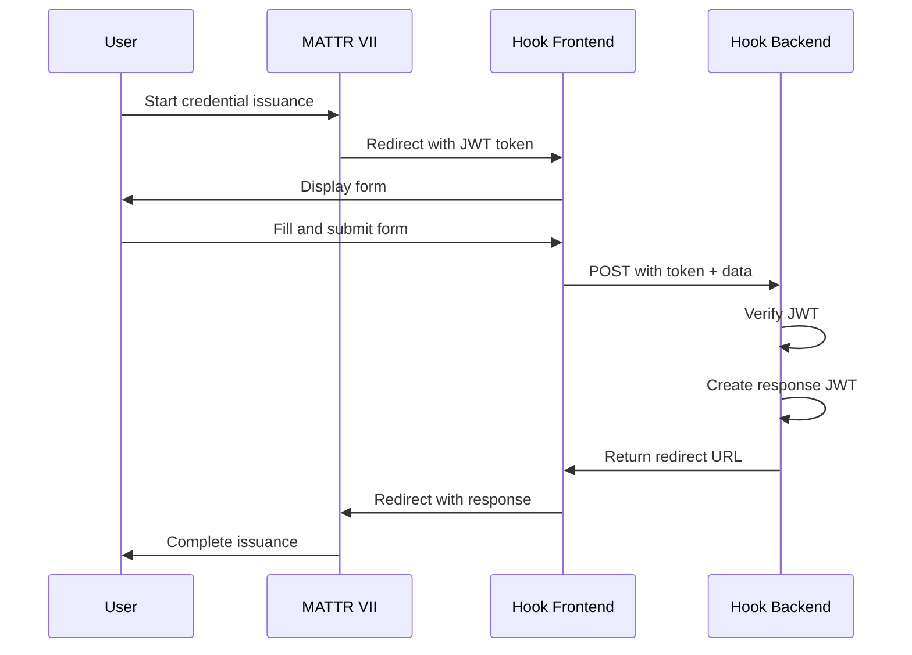

# MATTR VII Interaction Hook Tutorial

## Overview

This tutorial demonstrates how to build an **Interaction Hook** for MATTR VII - a custom web component that integrates into the credential issuance flow. Interaction hooks allow you to:

- 🎨 Create custom UI for collecting user information
- ✅ Validate data before credential issuance
- 🔄 Transform or enrich credential claims
- 🎯 Implement business logic during issuance

## Table of Contents

1. [Prerequisites](#prerequisites)
2. [Quick Start](#quick-start)
3. [Step-by-Step Tutorial](#step-by-step-tutorial)
4. [Testing Guide](#testing-guide)
5. [Troubleshooting](#troubleshooting)
6. [Architecture](#architecture)

## Prerequisites

- Node.js 20+ and npm
- MATTR VII tenant account with access to create interaction hooks
- ngrok installed for local development tunneling ([download here](https://ngrok.com/download))
- Basic knowledge of React and Next.js

## Quick Start

```bash
# 1. Clone the repository
git clone [repository-url]
cd interaction-hook-app

# 2. Install dependencies
npm install

# 3. Create environment file
touch .env.local

# 4. Configure MATTR VII interaction hook and get the secret

# 5. Update .env.local with your values

# 6. Start ngrok tunnel
ngrok http 3000
# Note: The sample app includes 'npm run tunnel' helper for this

# 7. Update APP_URL in .env.local with ngrok URL

# 8. Update interaction hook URL in MATTR VII

# 9. Start development server
npm run dev
```

## Step-by-Step Tutorial

### Section 1: Environment Configuration

#### Step 1.1: Configure MATTR VII Interaction Hook

1. Log into MATTR VII Console
2. Navigate to **Interactions** → **Interaction Hooks**
3. Create new hook with:
   - Name: "Employee Profile Hook"
   - URL: Will be set after starting ngrok
   - Method: POST
4. **Copy the secret that MATTR VII generates** - you'll need this for the next step

#### Step 1.2: Set Up ngrok

1. Install ngrok from [ngrok.com/download](https://ngrok.com/download)
2. (Optional) Create an account for persistent URLs
3. (Optional) If using the sample app's tunnel helper:
   - Get your authtoken from the ngrok dashboard
   - Add to `.env.local`: `NGROK_AUTHTOKEN=your_token`

#### Step 1.3: Configure Environment Variables

Create `.env.local` file:

```env
# Secret provided by MATTR VII (from Step 1.1)
INTERACTION_HOOK_SECRET="PASTE_SECRET_FROM_MATTR_VII_HERE"

# Your MATTR VII tenant URL
ISSUER_TENANT_URL="https://your-tenant.vii.au01.mattr.global"

# Will be set after starting ngrok
APP_URL="https://your-ngrok-url.ngrok.io"
```

#### Step 1.4: Start Tunnel and Complete Setup

```bash
# 1. Start ngrok tunnel
ngrok http 3000
# Note: The sample app includes 'npm run tunnel' as a helper

# 2. Copy the URL shown (e.g., https://abc123.ngrok-free.app)

# 3. Update APP_URL in .env.local

# 4. Go back to MATTR VII and update the interaction hook URL to:
#    https://abc123.ngrok-free.app/api/interaction-hook
```

### Section 2: Frontend Component Setup

The frontend component (`src/app/page.tsx`) handles the user interface. Key sections:

#### Step 2.1-2.4: Initial Setup
- Define constants (pronoun options)
- Set up routing and URL parameters
- Extract session token from URL

#### Step 2.5: Handle Missing Token
The component shows an error screen if accessed without proper authentication.

**✅ TEST POINT**: Visit `http://localhost:3000` without token to see error handling.

### Section 3: Form UI Implementation

#### Step 3.1-3.4: State Management
- Simple useState hooks for form fields
- JWT decoding (without verification)
- Pre-filling form with claims from MATTR VII

#### Step 3.5-3.9: Form Rendering
- Name input field
- Pronouns dropdown
- Conditional custom pronouns field
- Submit button with loading state

**✅ TEST POINT**: Visit `http://localhost:3000?session_token=test` to see the form UI.

### Section 4: Form Submission Handler

#### Step 4.1-4.7: Handle Submission
- Validate required fields
- Send data to backend API
- Handle response and redirect

### Section 5: Backend API Route - Initial Setup

The API route (`src/app/api/interaction-hook/route.ts`) handles server-side processing.

#### Step 5.1-5.2: Schema Definitions
- Request validation schema
- JWT payload schema

### Section 6: Backend JWT Processing - Full Implementation

#### Step 6.1-6.11: Complete JWT Flow
1. Parse and validate request
2. Load environment variables
3. Verify JWT from MATTR VII
4. Create response JWT with claims
5. Return redirect URL

**✅ TEST POINT**: Complete flow is now functional!

## Testing Guide

### Local Testing (Without MATTR VII)

#### 1. Test Frontend Only

```bash
npm run dev
# Visit: http://localhost:3000?session_token=test
# Form should display and be interactive
```

#### 2. Test Backend with Mock JWT

Create test JWT at [jwt.io](https://jwt.io):

**Header:**
```json
{
  "alg": "HS256",
  "typ": "JWT"
}
```

**Payload:**
```json
{
  "state": "test-state-123",
  "redirectUrl": "https://example.com/callback",
  "iss": "https://your-tenant.vii.au01.mattr.global",
  "aud": "https://your-app-url.ngrok.io",
  "iat": 1234567890,
  "exp": 9999999999
}
```

**Secret:** Your base64 secret (check the checkbox "secret base64 encoded")

Test with curl:
```bash
curl -X POST http://localhost:3000/api/interaction-hook \
  -H "Content-Type: application/json" \
  -d '{
    "token": "YOUR_TEST_JWT",
    "data": {
      "name": "Test User",
      "pronouns": "They/Them"
    }
  }'
```

### End-to-End Testing with MATTR VII

#### 1. Start Services

```bash
# Terminal 1: Start ngrok tunnel
ngrok http 3000
# (or use 'npm run tunnel' if using the sample app)

# Terminal 2: Start app
npm run dev

# Copy the ngrok URL and update APP_URL in .env.local
```

#### 2. Configure MATTR VII

1. Update interaction hook URL in MATTR VII to your ngrok URL
2. Ensure secrets match between MATTR VII and `.env`

#### 3. Test Credential Issuance

1. Initiate credential issuance in MATTR VII
2. You'll be redirected to your interaction hook
3. Fill out the form
4. Submit to complete the flow

## Troubleshooting

### Common Issues

#### "Session Token Missing" Error
- **Cause**: Accessing the page directly without MATTR VII
- **Solution**: Must access through MATTR VII credential issuance flow

#### "Invalid session token" (401 Error)
- **Cause**: JWT verification failed
- **Solutions**:
  - Verify `INTERACTION_HOOK_SECRET` matches the secret provided by MATTR VII
  - Ensure you copied the complete base64-encoded secret
  - Confirm `ISSUER_TENANT_URL` and `APP_URL` match exactly

#### "Server configuration error" (500 Error)
- **Cause**: Missing environment variables
- **Solutions**:
  - Check all variables in `.env.local` are set
  - Restart dev server after changing `.env.local`

#### Form submission fails
- **Cause**: Backend not running or network issue
- **Solutions**:
  - Ensure `npm run dev` is running
  - Check browser console for errors
  - Verify ngrok tunnel is active

### Debug Mode

The app includes debug logging in development mode:

1. **Frontend Debug Info**: Shows at bottom of form
   - Token presence
   - Claims extraction status
   - Pre-filled values

2. **Console Logs**: Check browser and server console
   - Remove these before deploying to production

## Architecture

### Flow Diagram



### Security Considerations

1. **JWT Verification**: Always happens server-side
2. **Secret Storage**: Never expose to frontend
3. **HTTPS Required**: Use ngrok for local development
4. **Token Expiry**: JWTs expire after 1 minute
5. **Input Validation**: Both frontend and backend validation

## Project Structure

```
interaction-hook-app/
├── src/
│   ├── app/
│   │   ├── page.tsx                 # Main UI component
│   │   ├── api/
│   │   │   └── interaction-hook/
│   │   │       └── route.ts         # API handler
│   │   ├── layout.tsx               # App layout
│   │   └── globals.css              # Global styles
├── .env-example                      # Environment template
├── package.json                      # Dependencies
├── tunnel.js                         # ngrok helper script
└── README.md                         # This file
```

## Next Steps

After completing this tutorial, you can:

1. **Customize the Form**: Add more fields relevant to your use case
2. **Add Validation**: Implement complex business rules
3. **Integrate Systems**: Connect to databases or external APIs
4. **Enhanced UI**: Add better styling, animations, or multi-step forms
5. **Production Deployment**: Deploy to Vercel, AWS, or your preferred platform

## Resources

- [MATTR VII Documentation](https://learn.mattr.global)
- [Interaction Hook Guide](https://learn.mattr.global/guides/oid4vci/interaction-hook-tutorial)
- [Next.js Documentation](https://nextjs.org/docs)
- [JWT.io](https://jwt.io) - JWT debugging tool
- [ngrok Documentation](https://ngrok.com/docs)

**Built with ❤️ by the MATTR Labs team**