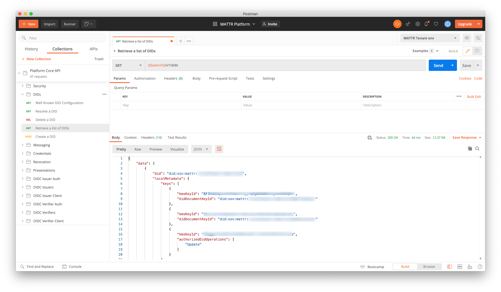

# Postman

Postman is a collaboration platform for API development. Postman's features simplify each step of building an API and streamline collaboration so you can create better APIs—faster.

## Install

Visit the Postman [downloads page](https://www.postman.com/downloads/) to install the desktop client for your system.

## Getting started
- Copy the `Platform Core API.postman_collection.json` and `MATTR Tenant env.postman_environment.json` and save them locally

## Setup

In Postman, a Collection is the series of operations and some configuration, Environment Variables hold specific values for your tenant. They need to be imported in 2 separate steps.

### First import the Tenant Environment Variables

Go to Manage Environment button in the top-right
Choose `Import` button

Select the `MATTR Tenant env.postman_environment.json` file from your local drive
Once the file has successfully imported you will see the Environment available

To add your Tenant specific variable click on the text `MATTR Tenant env`

* `baseUrl` is your full tenant URL
* `bearerToken` will be updated automatically using a Pre-request scripted (included)
* `auth_url` & `auth_audience` can remain as-is
* `auth_client_id` is your Client ID for authorization to the API 
* `auth_client_secret` is your Client Secret for authorization to the API
* `issuerDID` and `subjectDid` can be updated later

Click 'Update' to save.

### Next import the Collection

Click on 'Import' button in the menu in the top-left  

In File tab, click Upload file button
Select the `Platform Core API.postman_collection.json` file. 

Once the file has successfully imported you will see the Platform Core API Collection

## Try it out
First, make sure you can obtain a valid access token from the 'Create API Auth Token' endpoint inside the `Security` folder:

This operation will make use of the environment variables you configured above. If you do not obtain a valid 200 response then make sure you check your variables in Environment.

### Next step

Go to a protected endpoint e.g.
`DIDs` > `Retrieve a List of DIDs`

Hit `Send` in the top right of the Request pane (middle of the application)

See the response in the `Preview` section of the Response pane on the right.

## Further configuration
The Collection contains a Pre-Request script, which will fetch an access token from the Authorization Token endpoint if the access token in the `bearerToken` variable is missing or expired.

If you receive an 'unauthorized' error, check that you have selected the correct Environment and that this script matches those variables.

---

Copyright © MATTR Limited. <a href="./LICENSE">Some rights reserved.</a> “MATTR” is a trademark of MATTR Limited, registered in New Zealand and other countries.

