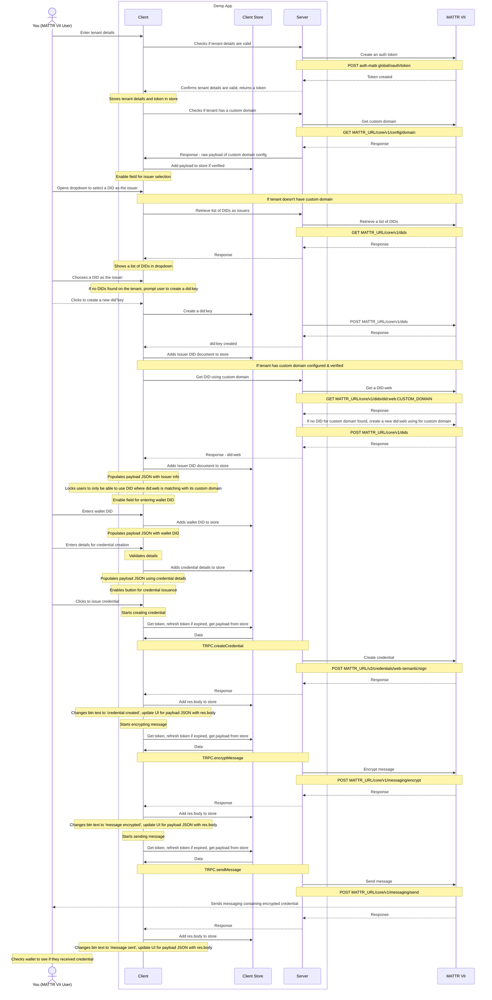

# Solution Architecture

## E2E

```mermaid
sequenceDiagram
    actor USER as You (MATTR VII User)

    box Demp App
    participant APP_CLIENT as Client
    participant APP_CLIENT_STORE as Client Store
    participant APP_SERVER as Server
    end

    participant MATTR as MATTR VII

    USER ->> APP_CLIENT: Enter tenant details
    APP_CLIENT ->> APP_SERVER: Checks if tenant details are valid
    APP_SERVER ->> MATTR: Create an auth token
    note over APP_SERVER, MATTR: POST auth.mattr.global/oauth/token
    MATTR -->> APP_SERVER: Token created
    APP_SERVER -->> APP_CLIENT: Confirms tenant details are valid, returns a token
    note over APP_CLIENT: Stores tenant details and token in store

    APP_CLIENT ->> APP_SERVER: Checks if tenant has a custom domain
    APP_SERVER ->> MATTR: Get custom domain
    note over APP_SERVER, MATTR: GET MATTR_URL/core/v1/config/domain
    MATTR -->> APP_SERVER: Response
    APP_SERVER ->> APP_CLIENT: Response - raw payload of custom domain conifg
    APP_CLIENT ->> APP_CLIENT_STORE: Add payload to store if verified
    note over APP_CLIENT: Enable field for issuer selection

    USER ->> APP_CLIENT: Opens dropdown to select a DID as the issuer

    note over APP_CLIENT, MATTR: If tenant doesn't have custom domain
    APP_CLIENT ->> APP_SERVER: Retrieve list of DIDs as issuers
    APP_SERVER ->> MATTR: Retrieve a list of DIDs
    note over APP_SERVER, MATTR: GET MATTR_URL/core/v1/dids
    MATTR -->> APP_SERVER: Response
    APP_SERVER -->> APP_CLIENT: Response
    note over APP_CLIENT: Shows a list of DIDs in dropdown
    USER ->> APP_CLIENT: Chooses a DID as the issuer
    note over APP_CLIENT: If no DIDs found on the tenant, prompt user to create a did:key
    USER -->> APP_CLIENT: Clicks to create a new did"key
    APP_CLIENT ->> APP_CLIENT_STORE: Create a did:key
    APP_SERVER ->> MATTR: POST MATTR_URL/core/v1/dids
    MATTR -->> APP_SERVER: Response
    APP_SERVER -->> APP_CLIENT: did:key created
    APP_CLIENT ->> APP_CLIENT_STORE: Adds Issuer DID document to store

    note over APP_CLIENT, MATTR: If tenant has custom domain configured & verified
    APP_CLIENT ->> APP_SERVER: Get DID using custom domain
    APP_SERVER ->> MATTR: Get a DID:web
    note over APP_SERVER, MATTR: GET MATTR_URL/core/v1/dids/did:web:CUSTOM_DOMAIN
    MATTR -->> APP_SERVER: Response
    APP_SERVER -->> MATTR: If no DID for custom domain found, create a new did:web using for custom domain
    note over APP_SERVER, MATTR: POST MATTR_URL/core/v1/dids
    MATTR -->> APP_SERVER: Response
    APP_SERVER -->> APP_CLIENT: Response - did:web
    APP_CLIENT ->> APP_CLIENT_STORE: Adds Issuer DID document to store
    note over APP_CLIENT: Populates payload JSON with Issuer info
    note over APP_CLIENT: Locks users to only be able to use DID where did:web is matching with its custom domain


    note over APP_CLIENT: Enable field for entering wallet DID
    USER ->> APP_CLIENT: Enters wallet DID
    APP_CLIENT ->> APP_CLIENT_STORE: Adds wallet DID to store
    note over APP_CLIENT: Populates payload JSON with wallet DID

    USER ->> APP_CLIENT: Enters details for credential creation
    note over APP_CLIENT: Validates details
    APP_CLIENT ->> APP_CLIENT_STORE: Adds credential details to store
    note over APP_CLIENT: Populates payload JSON using credential details
    note over APP_CLIENT: Enables button for credential issuance

    USER ->> APP_CLIENT: Clicks to issue credential

    note over APP_CLIENT: Starts creating credential
    APP_CLIENT ->> APP_CLIENT_STORE: Get token, refresh token if expired, get payload from store
    APP_CLIENT_STORE ->> APP_CLIENT: Data
    note over APP_CLIENT, APP_SERVER: TRPC.createCredential
    APP_SERVER ->> MATTR: Create credential
    note over APP_SERVER, MATTR: POST MATTR_URL/v2/credentials/web-semantic/sign
    MATTR -->> APP_SERVER: Response
    APP_SERVER -->> APP_CLIENT: Response
    APP_CLIENT ->> APP_CLIENT_STORE: Add res.body to store
    note over APP_CLIENT: Changes btn text to 'credential created', update UI for payload JSON with res.body

    note over APP_CLIENT: Starts encrypting message
    APP_CLIENT ->> APP_CLIENT_STORE: Get token, refresh token if expired, get payload from store
    APP_CLIENT_STORE ->> APP_CLIENT: Data
    note over APP_CLIENT, APP_SERVER: TRPC.encryptMessage
    APP_SERVER ->> MATTR: Encrypt message
    note over APP_SERVER, MATTR: POST MATTR_URL/core/v1/messaging/encrypt
    MATTR -->> APP_SERVER: Response
    APP_SERVER -->> APP_CLIENT: Response
    APP_CLIENT ->> APP_CLIENT_STORE: Add res.body to store
    note over APP_CLIENT: Changes btn text to 'message encrypted', update UI for payload JSON with res.body

    note over APP_CLIENT: Starts sending message
    APP_CLIENT ->> APP_CLIENT_STORE: Get token, refresh token if expired, get payload from store
    APP_CLIENT_STORE ->> APP_CLIENT: Data
    note over APP_CLIENT, APP_SERVER: TRPC.sendMessage
    APP_SERVER ->> MATTR: Send message
    note over APP_SERVER, MATTR: POST MATTR_URL/core/v1/messaging/send
    MATTR -->> USER: Sends messaging containing encrypted credential
    MATTR -->> APP_SERVER: Response
    APP_SERVER -->> APP_CLIENT: Response
    APP_CLIENT ->> APP_CLIENT_STORE: Add res.body to store
    note over APP_CLIENT: Changes btn text to 'message sent', update UI for payload JSON with res.body

    note over USER: Checks wallet to see if they received credential
```